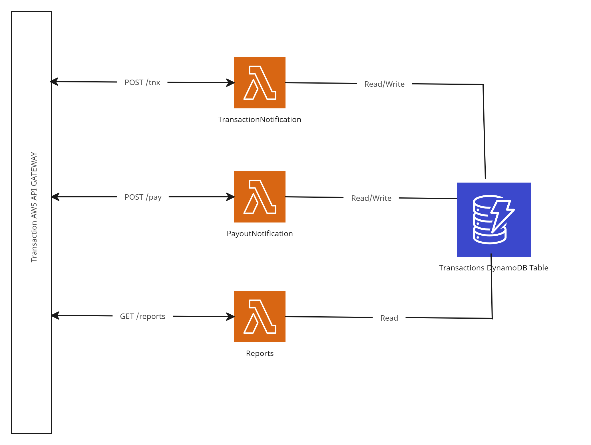

# Application overview

This repo is a solution for technical interview challenge by `Valpay`. It uses serverless architecture `lambda`, `api gateway` and `dynamodb`.

## Prerequisite To Install and Deploy

- *nix Destro Development was made on Ubuntu
- Makefile `sudo apt-get install makefile`
- [AWS CLI](https://docs.aws.amazon.com/cli/latest/userguide/getting-started-install.html)
- [AWS SAM](https://docs.aws.amazon.com/serverless-application-model/latest/developerguide/install-sam-cli.html)


## Stake Deployment Command

Below Makefile command is an abstraction for a guided deployment

```bash
  make deploy
```

### **Sample sam deploy command input:**

#### Setting default arguments for 'sam deploy':
```bash
 Stack Name [valpay]:
AWS Region [eu-west-1]:
Parameter Environment [dev]:
#Shows you resources changes to be deployed and require a 'Y' to initiate deploy
Confirm changes before deploy [y/N]: N
#SAM needs permission to be able to create roles to connect to the resources in your template
Allow SAM CLI IAM role creation [Y/n]: Y
#Preserves the state of previously provisioned resources when an operation fails
Disable rollback [y/N]: N
TransactionNotificationFun has no authentication. Is this okay? [y/N]: y
PayoutNotificationFun has no authentication. Is this okay? [y/N]: y
Save arguments to configuration file [Y/n]: n
```

## Application Explained:

I've used NoSQL key/value pair DynamoDB Table with `HASH` key `merchantId` and `RANGE` key `transactionId`. Also with secondary local index which is used to generate reports and for `query` operation with `RANGE` key `transactionDate`.

The Table Structure is as follows:

- merchantId (HASH), type String
- transactionId (RANGE), type String
- transactionDate (RANGE), type Number
- type, type String valid values `auth`, `refund` or `dispute`
- paymentTarget, type string valid values `valpay` or `merchant`
- payouts, type Array

On PayoutNotification the payouts array is appended onto the pay value provided from the `POST` payload of the `PayoutNotification` webhook

The application folows method factory pattern which create objects of type or paymentTarget which are constructed using strategy pattern

The Architecture is depicted by the below diagram:



## Limitations:

- AuthZ/AuthN not implemented possible solution **AWS Cognito** service
- Validation to be implemented, althoug stubs are created
- Error Handling to be implemented.
